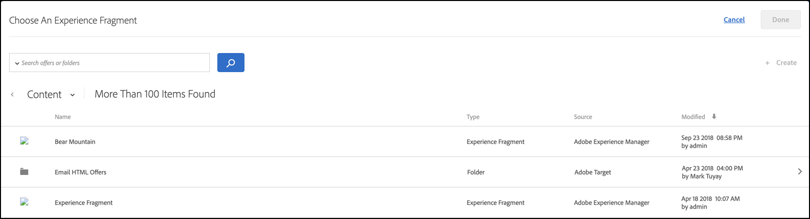

# AEM experience fragments{#aem-experience-fragments}

Information about using experience fragments created in [!DNL Adobe Experience Manager] (AEM) in [!DNL Target] activities to aid optimization or personalization.

>[!NOTE]
>
>This feature requires that you are an [!DNL Adobe Experience Manager] (AEM) customer. See [Requirements](../../c-experiences/c-manage-content/aem-experience-fragments.md#section_AE6F0971E1574B3AA324003599B96E5A), below, for more information.

## Overview {#section_95A91830530F493B81C5C9CDB9B783EA}

Using experience fragments created in AEM in [!DNL Target] activities lets you combine the ease-of-use and power of AEM with powerful Automated Intelligence (AI) and Machine Learning (ML) capabilities in [!DNL Target] to test and personalize experiences at scale.

AEM brings together all of your content and assets in a central location to fuel your personalization strategy. AEM lets you easily create content for desktops, tablets, and mobile devices in one location without writing code. There’s no need to create pages for every device. AEM automatically adjusts each experience using your content.

[!DNL Target] lets you deliver personalized experiences at scale based on a combination of rules-based and AI-driven machine learning approaches that incorporate behavioral, contextual, and offline variables. With [!DNL Target] you can easily set up and run [A/B Test](/help/c-activities/t-test-ab/test-ab.md) and [Multivariate](/help/c-activities/c-multivariate-testing/multivariate-testing.md) (MVT) activities to determine the best offers, content, and experiences.

Experience fragments represent a huge step forward to link the content/experience creators and managers to the optimization and personalization professionals who are driving business outcomes using [!DNL Target].

## Requirements {#section_AE6F0971E1574B3AA324003599B96E5A}

You must be provisioned with the experience fragments functionality within [!DNl Target]. In addition, you must be using AEM 6.3 with the appropriate service pack or AEM 6.4 (or later). Your account representative can help ensure that you meet the requirements to use this feature:

* Adobe Experience Manager 6.4 (or later). 
* Adobe Experience Manager 6.3 SP2 (or later). 
* Adobe Target Standard or Adobe Target Premium account. 
* Contact [Adobe Target Customer Care](/help/cmp-resources-and-contact-information.md#reference_ACA3391A00EF467B87930A450050077C) to enable the integration and to provide you with authentication details.

## Creating and Configuring Experience Fragments in AEM {#section_745C8EFE29F547A2958FDBF61A5ADF7B}

In order to use AEM experience fragments in [!DNL Target], you must perform the following steps:

### Step 1: Integrate AEM with Target

For more information, see:

* **AEM 6.3**: [Opting into Adobe Analytics and Adobe Target](https://docs.adobe.com/docs/en/aem/6-3/administer/integration/marketing-cloud/opt-in.html) in the _Adobe Experience Manager 6.3_ documentation.
* **AEM 6.4**: [Opting into Adobe Analytics and Adobe Target](https://helpx.adobe.com/experience-manager/6-4/sites/administering/using/opt-in.html) in the _Adobe Experience Manager 6.4_ documentation.
* **AEM 6.5**: [Opting into Adobe Analytics and Adobe Target](https://helpx.adobe.com/experience-manager/6-5/sites/administering/using/opt-in.html) in the *Adobe Experience Manager 6.5* documentation.

### Step 2: Create the experience fragment

Experience fragments are created in AEM. For more information, see:

* **AEM 6.3**: [Experience Fragments](https://docs.adobe.com/docs/en/aem/6-3/author/experience-fragments.html) in the *Adobe Experience Manager 6.3* documentation.
* **AEM 6.4**: [Experience Fragments](https://helpx.adobe.com/experience-manager/6-4/sites/authoring/using/experience-fragments.html) in the *Adobe Experience Manager 6.4* documentation.
* **AEM 6.5**: [Experience Fragments](https://helpx.adobe.com/experience-manager/6-5/sites/authoring/using/experience-fragments.html) in the *Adobe Experience Manager 6.5* documentation.

### Step 3: Configure AEM to share the experience fragment with Target

1. From within AEM, select the desired experience fragment or its containing folder, then click **[!UICONTROL Properties]**.
2. Click the **[!UICONTROL Cloud Services]** tab, then from the **[!UICONTROL Cloud Service Configuration]** drop-down list, select **[!UICONTROL Adobe Target]**.

   >[!NOTE]
   >
   >The previous step assumes that someone in your organization has created the [!DNL Adobe Target] configuration.

3. Click **[!UICONTROL Save & Close]**.

### Step 4: Publish the experience fragment and export it into Target

Depending on your AEM version, see the following links for step-by-step instructions:

* **AEM 6.3**: [Exporting an Experience Fragment to Target](https://helpx.adobe.com/experience-manager/6-3/sites/administering/using/experience-fragments-target.html) in the *Adobe Experience Manager 6.3* documentation.
* **AEM 6.4**: [Exporting an Experience Fragment to Target](https://docs.adobe.com/content/help/en/experience-manager-64/administering/integration/experience-fragments-target.html) in the *Adobe Experience Manager 6.4* documentation.
* **AEM 6.5**: [Exporting an Experience Fragment to Target](https://helpx.adobe.com/experience-manager/6-5/sites/administering/using/experience-fragments-target.html) in the *Adobe Experience Manager 6.5* documentation.

## Using Experience Fragments in Target Activities {#section_17CE4BE6B2B74CCEBAE0C68DEB84ABB9}

After performing the preceding tasks, the experience fragment displays on the [!UICONTROL Offers] page in Target.

>[!NOTE]
>
>[!DNL Target] currently looks for experience fragments to import every ten minutes. The imported experience fragment should be available in [!DNL Target] within ten minutes, but this time frame should shorten going forward.

>[!IMPORTANT]
>
>The experience fragment is currently imported into [!DNL Target] as an HTML offer. Note that the experience fragment "master" version remains in AEM. You cannot edit the experience fragment in Target.

You can hover over an experience fragment in the list, then click the View icon  to see additional information about the experience fragment, including its public offer delivery URL, its AEM path, and a deep link to open the experience fragment inside of AEM.

You can consume Experience Fragments in [!DNL Target] activities using the [Visual Experience Composer](/help/c-experiences/c-visual-experience-composer/visual-experience-composer.md) (VEC) or the [Form-Based Experience Composer](/help/c-experiences/form-experience-composer.md).

>[!NOTE]
>
>To fully utilize the [!DNL Target] AI and ML functionality, you can select [Auto-Allocate](../../c-activities/automated-traffic-allocation/automated-traffic-allocation.md#concept_A1407678796B4C569E94CBA8A9F7F5D4) or [Auto-Allocate](/help/c-activities/automated-traffic-allocation/automated-traffic-allocation.md) while creating an A/B Test.

**To consume Experience Fragments using the VEC:**

1. In [!DNL Target], while creating or editing an experience in the [Visual Experience Composer](../../c-experiences/experiences.md#concept_A2E10F6AFB3D4AEAB6951EE14688848D), click the location on the page where you want to insert AEM content, then select the desired option to display the [!UICONTROL Choose an Experience Fragment] list.

   * [!UICONTROL Insert Before]
   * [!UICONTROL Insert After]
   * [!UICONTROL Swap with Experience Fragment]

   The [!UICONTROL Experience Fragment] list displays all of the content created in AEM that is now natively available from within [!DNL Target].

   >[!NOTE]
   >
   >The [!UICONTROL Swap with Experience Fragment] option is not available for images. If you want to use this option with an image, click the container element that contains the desired image.

   

1. Select the desired experience fragment, then click **[!UICONTROL Done]**. 
1. Finish configuring the activity.

   For more information about configuring the various activity types, see the following topics:

    * **A/B Test:** [Create an A/B Test](../../c-activities/t-test-ab/t-test-create-ab/test-create-ab.md#task_68C8079BF9FF4625A3BD6680D554BB72) 
    * **Auto-Allocate:** [Auto-Allocate](../../c-activities/automated-traffic-allocation/automated-traffic-allocation.md#concept_A1407678796B4C569E94CBA8A9F7F5D4) 
    * **Auto-Target:** [Auto-Target For Personalized Experiences](../../c-activities/auto-target-to-optimize.md#concept_67779E5B7F67427A97D7EA2A6FB919B3) 
    * **Automated Personalization (AP):** [Creating an Automated Personalization Activity](../../c-activities/t-automated-personalization/create-ap-activity.md#task_8AAF837796D74CF893CA2F88BA1491C9) 
    * **Experience Targeting (XT):** [Create an Experience Targeting Activity](../../c-activities/t-experience-target/t-xt-create/xt-create.md#task_D6B3429AC31549E1A70EDF04B3DDC765) 
    * **Multivariate Test (MVT):** [Create a Multivariate Test](../../c-activities/c-multivariate-testing/t-create-multivariate-test/create-multivariate-test.md#task_BF870FA60A8245AB8F0B775BE32EA710) 
    * **Recommendations:** [Create a Recommendations Activity](../../c-recommendations/t-create-recs-activity/create-recs-activity.md#task_6874328773C64C44A73F0A130AD3F96F)

**To consume Experience Fragments using the Form-based Experience Composer:**

1. In [!DNl Target], while creating or editing an experience in the [Form-Based Experience Composer](../../c-experiences/form-experience-composer.md#task_FAC842A6535045B68B4C1AD3E657E56E), select the location on the page where you want to insert AEM content, then select **[!UICONTROL Change Experience Fragment]** to display the [!UICONTROL Choose an Experience Fragment] list.

   

   The [!UICONTROL Experience Fragment] list displays all of the content created in AEM that is now natively available from within [!DNL Target]. 

1. Select the desired experience fragment, then click **[!UICONTROL Save]**. 
1. Finish configuring the activity.

## Considerations {#considerations}

* [!DNL Target] currently looks for experience fragments to import every ten minutes. The imported experience fragment should be available in [!DNL Target] within ten minutes, but this time frame should shorten going forward.
* The experience fragment is currently imported into [!DNL Target] as an HTML offer. Note that the experience fragment "master" version remains in AEM. You cannot edit the experience fragment in [!DNL Target].
* You can import JSON offers as experience fragments into [!DNL Target]. However, these offers are imported as HTML offers. JSON offers (experience fragments) are currently not fully supported in the [!DNL Target] UI.

## Training video: Using AEM Experience Fragments with Adobe Target {#section_C0EDC54063464F41A182492D2045BC64}

The following video shows you how to set up and use experience fragments: [Using AEM Experience Fragments with Adobe Target](https://helpx.adobe.com/experience-manager/kt/sites/using/experience-fragment-target-feature-video-use.html). 
