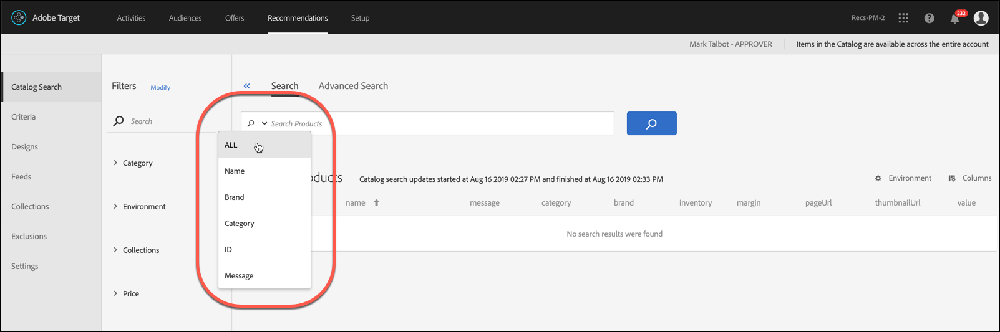

#  Catalog search {#catalog-search}

The catalog search helps you locate the products or content in your catalog.

To access catalog search, click **[!UICONTROL Recommendations]** > **[!UICONTROL Catalog Search]**.

You can refine your search by selecting a search option from the options menu that displays when you click the down arrow in the search field.

Search options include the following:

* ALL
* Name
* Brand
* Category
* ID
* Message

**[!UICONTROL ALL]** searches across all of the other search criteria, using OR logic.

In the search results, you click the **[!UICONTROL Environment]** filter to specify the production [host group environment](/help/administrating-target/hosts.md) whose catalog you are displaying. You can also scroll through the items in the search results to view thumbnails and other product information.

The number that displays next to "Products" is the number of products that match the search term, out of the total available in the specified environment.

The catalog is automatically refreshed when updates are received via feed files, API, or mbox updates. Updates are usually completed in an hour. If updates are in progress, the time that the most recent update started displays. If no updates are in progress, the time that the most recent update started and finished displays.

## Create a collection or exclusion based on Advanced Search

You can create [collections](/help/c-recommendations/c-products/collections.md) or [exclusions](/help/c-recommendations/c-products/exclusions.md) using Advanced Search on the Catalog Search page ([!UICONTROL Recommendations] > [!UICONTROL Catalog Search] > [!UICONTROL Advanced Search]). 

After creating a search using "id > contains," for example, you can then click [!UICONTROL Save As] > [!UICONTROL Collection or Exclusion].

>[!IMPORTANT]
>
>The Advanced Search functionality is case-insensitive; however, products returned at the time of delivery are based on case-sensitive search. This mismatch might lead to confusion. Ensure that you consider case-sensitivity when you create collections or exclusions based on results using the Advanced Search functionality. For example, if you perform a search for "Holiday," that initial search lists results containing "Holiday" and "holiday." If you then create a catalog with the intent to return products containing "holiday," only products containing "holiday" are returned. Products containing "Holiday" are not returned. Exclusions are handled in a similar fashion.
