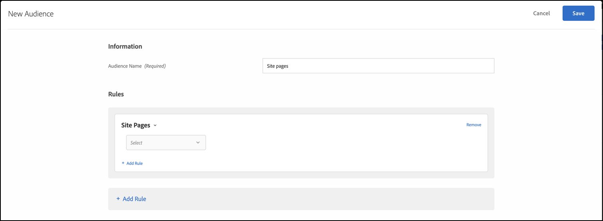
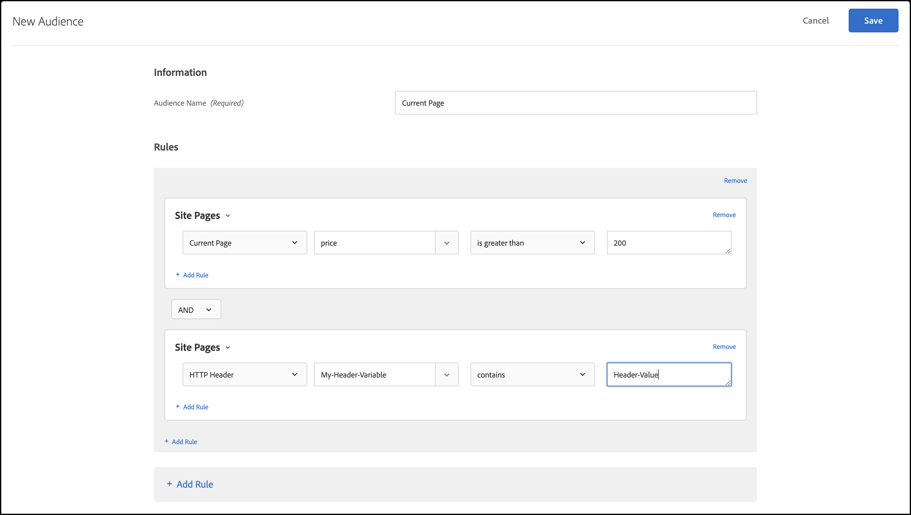

# Site Pages{#site-pages}

You can target visitors who are on a specific page on your site.

1. In the [!DNL Target] interface, click **[!UICONTROL Audiences]** > **[!UICONTROL Create Audience]**. 
1. Name the audience. 
1. Click **[!UICONTROL Add Rule]** > **[!UICONTROL Site Pages]**.

   

1. Click the **[!UICONTROL Select]** drop-down list, select one of the following options, then configure the rule as desired.

    The available options and evaluators in subsequent drop-down lists in the rule vary depending on which option you choose. The following illustration shows the available options if you choose [!UICONTROL Current Page]:

     

    The following options are available in the intitial drop-down list when you choose [!UICONTROL Select].

    * **Current Page:** The page the user is currently on.

      The following options are available in the second drop-down list if you choose this option:

      * URL
      * Domain
      * Query
      * Subdomain
      * Top-Level Domain
      * Path
      * Hash (#) fragment

    * **Previous Page:** The page the user was on before clicking to the current page. (The user has to click from the previous page to the current page for the page to be tracked. The previous page is not tracked if the user types a new URL in the browser.) The actual content of this page depends on the design of your site. For example, if the current page displays information about a specific product, the previous page might be a category page where the visitor selects the specific item (such as a page displaying several cameras of a certain type), or it might be the home page that leads to the final page.

      The following options are available in the second drop-down list if you choose this option:

      * URL
      * Domain
      * Query
      * Subdomain
      * Top-Level Domain
      * Path

    * **Landing Page:** The landing page is the first page the visitor sees when accessing your site. For example, if the visitor clicks a link on Google that leads to a category page, then the category page is the landing page. If the link leads to your home page, then the home page is the landing page. The landing page is remembered for the visitor's session. You can target deeper in the site based on what the visitor's landing page was in this session.

      The following options are available in the second drop-down list if you choose this option:

      * URL
      * Domain
      * Query
      * Subdomain
      * Top-Level Domain
      * Path
      * Hash (#) fragment

      >[!NOTE]
      >
      >The `landing.url` object is reset on a subdomain change or direct URL replacement. 

    * **HTTP Header:** This option evaluates the information in the HTTP header of the Target request. For example, if the HTTP header contains language information, you could create a rule that contains the `Accept-Language: es` condition to target visitors who access the page in Spanish.

      The following options are available in the second drop-down list if you choose this option:

      * Accept
      * Accept-Charset
      * Accept-Encoding
      * Accept-Language
      * Authorization
      * Cache-Control
      * Connection
      * Content-Length
      * Content-MDS
      * Content-Type
      * Date
      * Expect
      * From
      * Host
      * If-Match
      * If-Modified-Since
      * If-None-Match
      * If-Range
      * If-Unmodified-Since
      * Max-Forwards
      * Pragma
      * Proxy-Authoriztion
      * Range
      * Referer
      * TE
      * Upgrade
      * User-Agent
      * Via
      * Warning

   If you chose [!UICONTROL Current Page], [!UICONTROL Previous Page], or [!UICONTROL Landing Page], the [!UICONTROL Domain] and [!UICONTROL Query] options are available. Consider the following when choosing these options:

    * **Domain:** The full domain of the page. When specifying a domain, best practice is to use "contains." For example, "Domain equals facebook.com" will not accept `m.facebook.com` or `www.facebook.com`. "Domain contains facebook.com" will accept any variant of facebook.com. 
    * **Query:** The content of the URL after the first question mark (?).

      `foo.html?e0a72cb2a2c7`

1. (Optional) Click **[!UICONTROL Add Rule]** and set up additional rules for the audience. 
1. Click **[!UICONTROL Save]**.

You can also create site pages audiences using you own "user-defined query parameter" or "user-defined header."

Use a:

* Query parameter if the rule selected by the user is Current Page, Landing Page, or Previous Page. 
* Header if the rule select by the user is an HTTP header.

as illustrated below:

## Troubleshooting {#ts}

* For landing page audiences to function properly, requests must have the `mboxReferrer` parameter set (for the Delivery API the `context.address.referringUrl` parameter) that the at.js JavaScript library takes from the page using the `document.referrer` attribute. This `HTMLDocument` attribute returns the URI of the page the user has navigated from. The value of this attribute is an empty string when the user navigates to the page directly (not through a link, but, for example, via a bookmark).

  If this behaviour does not match your requirements, consider performing one of the following actions:

  * Pass [mbox parameters](/help/c-implementing-target/c-implementing-target-for-client-side-web/t-mbox-download/c-understanding-global-mbox/pass-parameters-to-global-mbox.md) to [!DNL Target] to be used for targeting purposes.
  * Use an [A/B Test activity](/help/c-activities/t-test-ab/test-ab.md) instead of a landing page activity. A/B Test activities do not switch experiences for the same visitor.
  * Use a [visitor profile](/help/c-target/c-audiences/c-target-rules/visitor-profile.md) instead.

## Training video: Creating Audiences

This video includes information about using audience categories.

* Create audiences 
* Define audience categories

>[!VIDEO](https://video.tv.adobe.com/v/17392) 
